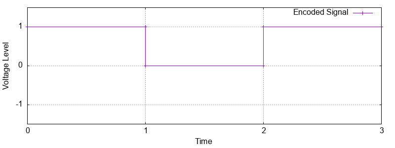

# Line Coding Visualizer

A C++ project that simulates and visualizes digital line coding schemes commonly used in physical layer communication.  
It supports encoding binary data using Unipolar NRZ, Polar NRZ-L, Bipolar AMI, and Manchester encoding techniques, and generates waveform data for visualization via Gnuplot.

# Features

- Encode user input binary strings using:
  - Unipolar NRZ
  - Polar NRZ-L
  - Bipolar AMI
  - Manchester Encoding
- Generates data files (`.dat`) for waveform plotting
- Prints Gnuplot script to visualize encoded waveforms
- Demonstrates concepts of inheritance, polymorphism, and abstract classes in C++

# Sample Output

Gnuplot-generated waveform for `10101` using Manchester encoding:



# Technologies Used

- **C++**
- **Gnuplot** (for waveform plotting)
- Command-line interface

# ▶️ How to Run

1. **Compile the code:**

   ```bash
   g++ LineCodingVisualizer.cpp -o linecoder

2. **Run the program:**
./linecoder

3. **Follow prompts to enter binary data and choose the encoding scheme.**

4. **Copy the printed Gnuplot script into a .gnu file (e.g., plot.gnu) or paste into terminal if Gnuplot is installed.**

5. **Generate waveform image:**
gnuplot plot.gnu

# Output Files
signal.dat → voltage levels over time
line_coding_waveform.png → final waveform image
Gnuplot script for visualization

# License
This project is © 2025 Anushka Gupta.
